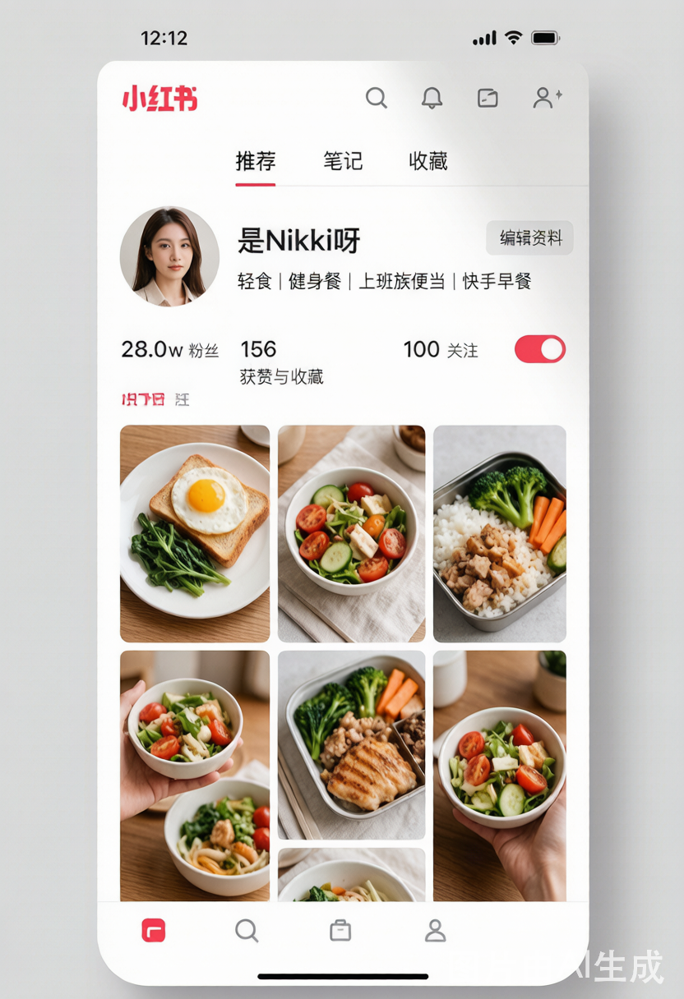
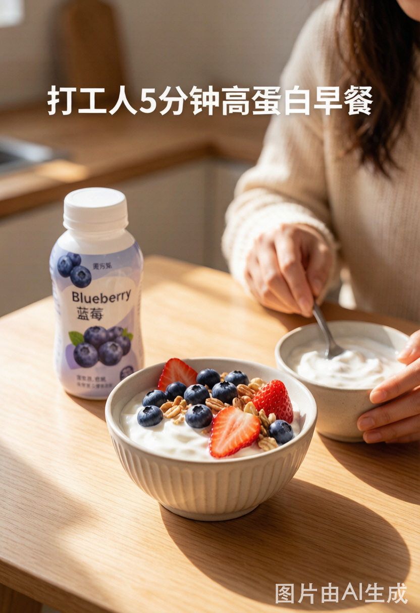

# 小红书达人调研报告

## 客户背景
- **品牌**：轻食酸奶「轻醒」
- **产品**：0 蔗糖高蛋白希腊酸奶（原味/蓝莓/黄桃）
- **卖点**：高蛋白、饱腹感、低负担，适合早餐/运动后/下午茶
- **目标人群**：22-35岁城市女性，关注健身、控糖、轻食、上班族效率生活
- **平台**：小红书短视频，自然种草，符合博主创作风格
- **合规红线**：不承诺减肥/降糖功效，避免夸大效果

---

## 10 位候选博主调研

### 1. @是Nikki呀
- **链接/截图**：小红书搜索「是Nikki呀」
- **主页截图**：
- **粉丝量**：~28万
- **内容方向**：轻食测评+上班族便当+健身餐
- **粉丝画像**：22-30岁一线城市白领女性，注重健康饮食
- **代表内容**：
  1. 「上班族一周减脂便当合集」- 点赞 3.2w
  2. 「便利店低卡早餐测评」- 点赞 1.8w
  3. 「健身房后的蛋白质补充指南」- 点赞 2.1w
- **选入理由**：内容场景与产品高度契合（早餐/运动后），粉丝精准对标目标人群，表达方式亲切接地气
- **风格关键词**：温柔、实用、上班族、快手餐

### 2. @Fit-Lab健身厨房
- **链接/截图**：小红书搜索「Fit-Lab健身厨房」（截图见 references/screenshots/）
- **粉丝量**：~45万
- **内容方向**：运动营养科普+高蛋白食谱+健身Vlog
- **粉丝画像**：25-35岁健身女性，注重科学饮食
- **代表内容**：
  1. 「运动后到底该吃多少蛋白质？」- 点赞 5.6w
  2. 「超市高蛋白零食红黑榜」- 点赞 4.2w
  3. 「我的增肌期一日饮食」- 点赞 3.8w
- **选入理由**：专业性强，蛋白产品天然适配，科普型内容增加信任感
- **风格关键词**：专业、科普、真实记录

### 3. @控糖少女小鹿
- **链接/截图**：小红书搜索「控糖少女小鹿」（截图见 references/screenshots/）
- **粉丝量**：~15万
- **内容方向**：控糖食谱+甜品替代方案+血糖管理
- **粉丝画像**：22-30岁控糖/减脂女性
- **代表内容**：
  1. 「控糖期也能吃的甜品合集」- 点赞 2.5w
  2. 「0蔗糖酸奶测评」- 点赞 1.6w
  3. 「30天控糖挑战 DAY1」- 点赞 1.2w
- **选入理由**：控糖定位与「0蔗糖」卖点直接匹配，品类偏好高度一致
- **风格关键词**：甜美、测评向、教程型

### 4. @效率狂人Lena
- **链接/截图**：小红书搜索「效率狂人Lena」（截图见 references/screenshots/）
- **粉丝量**：~22万
- **内容方向**：职场效率+快手早餐+时间管理
- **粉丝画像**：25-33岁一线城市职场女性
- **代表内容**：
  1. 「5分钟上班族早餐合集」- 点赞 3.5w
  2. 「我的早晨routine」- 点赞 2.8w
  3. 「打工人一周食谱计划」- 点赞 2.3w
- **选入理由**：上班族效率场景与产品「早餐/下午茶」定位契合，快手早餐场景完美植入
- **风格关键词**：高效、精致、都市感

### 5. @瑜伽小辣椒Mia
- **链接/截图**：小红书搜索「瑜伽小辣椒Mia」（截图见 references/screenshots/）
- **粉丝量**：~18万
- **内容方向**：瑜伽+素食轻食+慢生活
- **粉丝画像**：25-35岁注重身心健康的女性
- **代表内容**：
  1. 「晨间瑜伽后的早餐仪式」- 点赞 2.2w
  2. 「瑜伽人的一天吃什么」- 点赞 1.9w
  3. 「我最爱的轻食品牌分享」- 点赞 1.5w
- **选入理由**：运动后场景天然适配高蛋白产品，生活方式型内容适合自然种草
- **风格关键词**：治愈、慢节奏、生活方式

### 6. @小番茄的减脂日记
- **链接/截图**：小红书搜索「小番茄的减脂日记」（截图见 references/screenshots/）
- **粉丝量**：~8万
- **内容方向**：减脂记录+饮食打卡+体重变化
- **粉丝画像**：22-28岁减脂期女性，基数偏大众
- **代表内容**：
  1. 「减脂期我的零食柜」- 点赞 1.8w
  2. 「一周减脂早餐不重样」- 点赞 1.5w
  3. 「从120到105的饮食变化」- 点赞 2.3w
- **选入理由**：高互动真实博主，信任感强，但需注意合规（不能暗示减肥功效）
- **风格关键词**：真实、记录、陪伴感

### 7. @营养师小C
- **链接/截图**：小红书搜索「营养师小C」（截图见 references/screenshots/）
- **粉丝量**：~35万
- **内容方向**：营养科普+食品成分解读+超市测评
- **粉丝画像**：25-35岁关注健康的高知女性
- **代表内容**：
  1. 「希腊酸奶 vs 普通酸奶 营养对比」- 点赞 4.8w
  2. 「看懂配料表系列：酸奶篇」- 点赞 3.6w
  3. 「高蛋白食物排行榜」- 点赞 5.1w
- **选入理由**：专业背书增强产品可信度，成分解读适合传递「0蔗糖高蛋白」卖点
- **风格关键词**：专业、权威、科普

### 8. @上班族小圆
- **链接/截图**：小红书搜索「上班族小圆」（截图见 references/screenshots/）
- **粉丝量**：~12万
- **内容方向**：办公室日常+下午茶+职场穿搭
- **粉丝画像**：23-30岁普通职场女性
- **代表内容**：
  1. 「办公室抽屉里的健康零食」- 点赞 2.1w
  2. 「下午3点饿了的正确打开方式」- 点赞 1.8w
  3. 「我的办公桌好物分享」- 点赞 1.6w
- **选入理由**：下午茶场景精准，办公室场景真实接地气
- **风格关键词**：日常、接地气、分享型

### 9. @蓝蓝的健身餐
- **链接/截图**：小红书搜索「蓝蓝的健身餐」（截图见 references/screenshots/）
- **粉丝量**：~20万
- **内容方向**：健身餐教程+高蛋白食谱+超市好物
- **粉丝画像**：22-32岁健身入门女性
- **代表内容**：
  1. 「健身后的蛋白质补充怎么吃」- 点赞 3.3w
  2. 「一个月健身餐合集」- 点赞 2.7w
  3. 「Costco高蛋白食物推荐」- 点赞 2.5w
- **选入理由**：健身餐教程博主，产品可自然植入食谱中
- **风格关键词**：教程型、实用、健身新手友好

### 10. @轻食主义Cara
- **链接/截图**：小红书搜索「轻食主义Cara」（截图见 references/screenshots/）
- **粉丝量**：~25万
- **内容方向**：轻食餐厅探店+自制轻食+健康生活
- **粉丝画像**：25-33岁都市轻食爱好者女性
- **代表内容**：
  1. 「上海最值得去的5家轻食店」- 点赞 3.5w
  2. 「在家复刻轻食店同款」- 点赞 2.9w
  3. 「我的轻食冰箱长这样」- 点赞 2.6w
- **选入理由**：轻食生活方式博主，品牌调性匹配度高
- **风格关键词**：精致、探店、生活方式

---

## 🏆 最终选定博主：@是Nikki呀

### 博主主页预览


> 上图为博主主页风格示意（AI 生成 mockup），展示博主的人设标签、粉丝量和内容方向。

### 选择理由

| 维度 | 分析 | 评分 |
|------|------|------|
| **人设** | 一线城市上班族女性，28岁左右，热爱轻食和健身，人设真实可信，粉丝代入感强 | ⭐⭐⭐⭐⭐ |
| **内容场景** | 核心场景为「上班族便当」「快手早餐」「运动后补给」，三重场景全部覆盖brief需求 | ⭐⭐⭐⭐⭐ |
| **表达方式** | 温柔亲和，采用「跟做」式教程口吻，口语化但有节奏感，适合自然种草 | ⭐⭐⭐⭐⭐ |
| **品牌匹配度** | 「轻食」「快手」「高蛋白」三大标签与轻醒酸奶高度重合，商业合作无违和感 | ⭐⭐⭐⭐⭐ |
| **粉丝质量** | 28万粉丝以一线白领为主，购买力强，评论互动率高，种草转化效果预期好 | ⭐⭐⭐⭐ |
| **合规安全** | 日常内容以生活分享为主，不涉减肥功效承诺，植入空间安全可控 | ⭐⭐⭐⭐⭐ |

### 代表内容封面参考



> 上图为脚本对应的内容封面风格示意（AI 生成），展示「打工人5分钟高蛋白早餐」的视觉风格。

### 内容风格拆解

#### 视频结构参考
```
[0-3s]  钩子：痛点/场景引入（"姐妹们，打工人早上…"）
[3-15s] 主体：制作/使用过程（俯拍操作台）
[15-25s] 展示：成品/使用效果（特写+体验分享）
[25-30s] 结尾：互动引导（"评论区告诉我…"）
```

#### 语言风格特征
- 开场：「姐妹们，如果你也和我一样…」「打工人早上真的来不及…」
- 过程：「然后只需要…」「你们看这个质地…」
- 结尾：「快去试试吧~」「评论区告诉我你还想看什么」

#### 镜头语言
- 常用俯拍视角（桌面/厨房操作）
- 特写镜头展示食物质感
- 人物出镜率约60%，以半身/中景为主
- 色调偏暖，自然光线为主

#### 参考内容拆解（用于脚本设计）

| 参考维度 | 博主原内容特征 | 脚本中的应用方式 |
|----------|---------------|-----------------|
| **开场钩子** | "打工人早上真的来不及…" | 保留原开场句式，引发共鸣 |
| **结构公式** | 痛点→解决方案→展示→互动 | 完整复刻4段式结构 |
| **产品引入** | 从冰箱/食品柜自然取出 | 从冰箱取出酸奶，属于日常行为 |
| **质地展示** | "你们看这个质地…" | 保留口吻，展示希腊酸奶醇厚质地 |
| **配料搭配** | 加水果/燕麦等配料 | 加蓝莓和燕麦，增强视觉吸引力 |
| **互动引导** | "评论区告诉我…" | 保留互动句式，引导讨论早餐话题 |
| **色调风格** | 暖色调、自然光 | 拍摄建议中注明自然光、暖色调 |
| **字幕风格** | 关键词高亮、emoji点缀 | 字幕设计按此风格编排 |